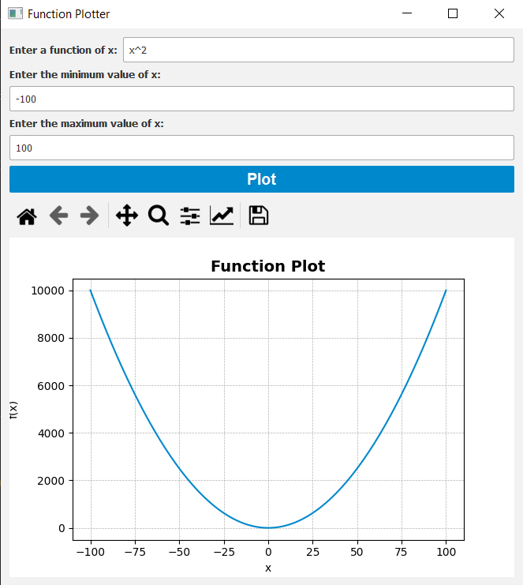
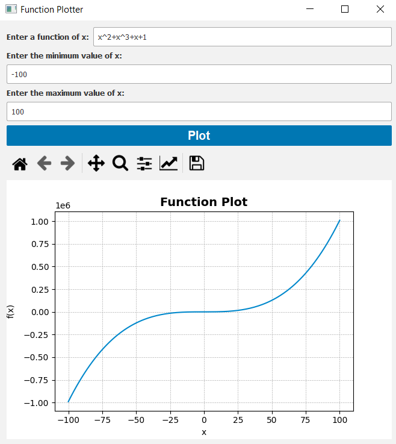
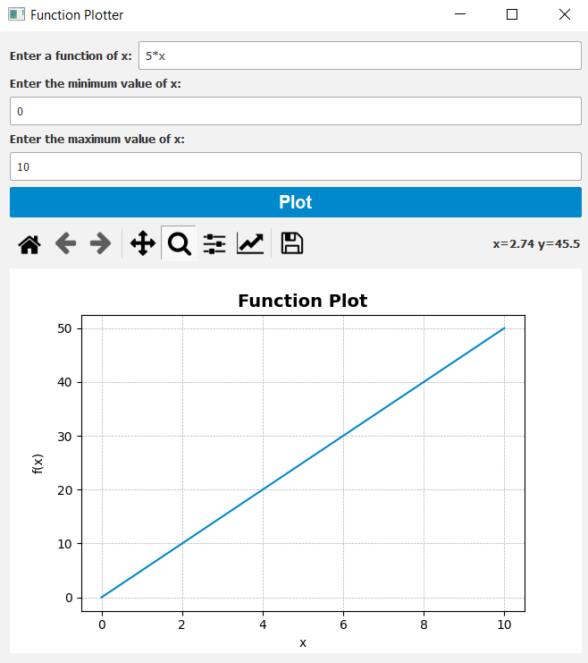
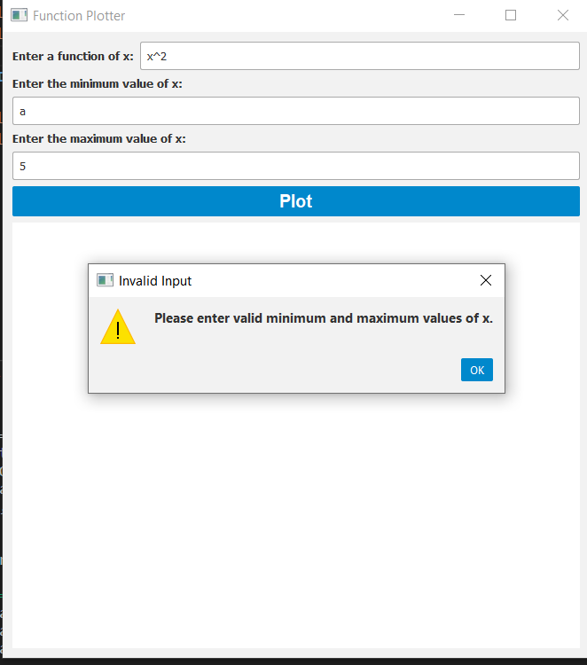
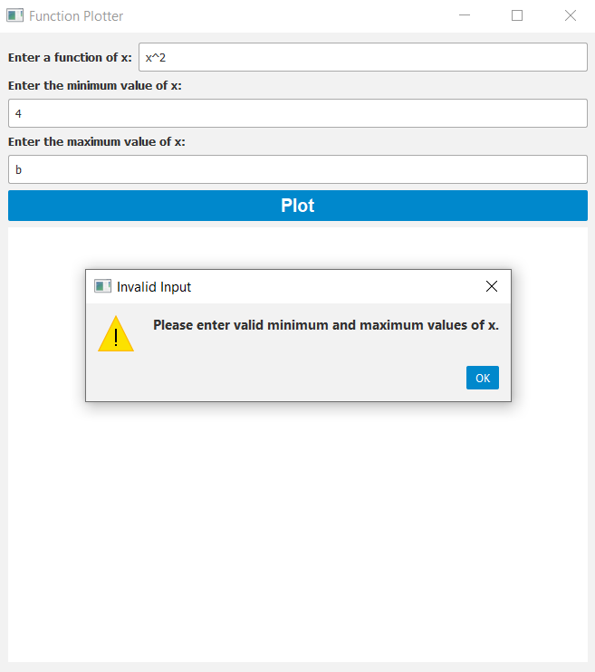
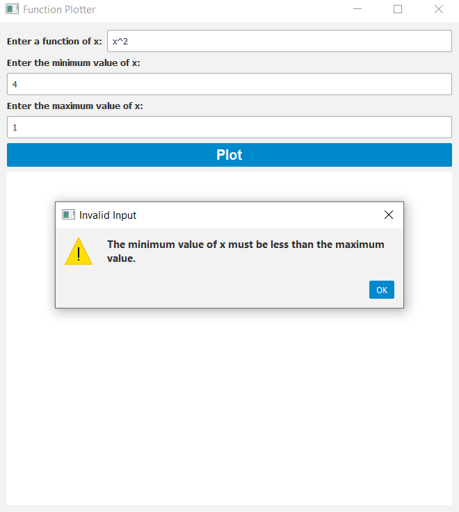
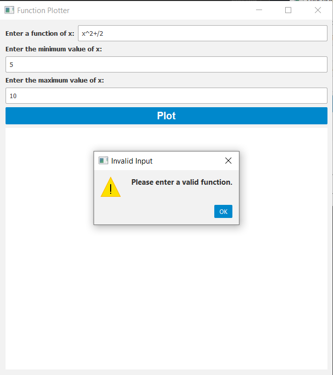

# Function Plotter

Function Plotter is a Python application built using PySide2 and Matplotlib that allows users to plot mathematical functions. It provides a graphical user interface (GUI) where users can enter a function of x, specify the range of x values, and plot the corresponding function curve.

## Features

- Enter a function of x using basic arithmetic operations (+, -, \*, /) and exponentiation (^).
- Specify the minimum and maximum values of x to define the range of the plot.
- Plot the function curve based on the user's input.
- The plot is displayed using Matplotlib, a powerful plotting library.
- GUI elements are styled using PySide2's Qt-based stylesheet support.
- The GUI provides an intuitive and user-friendly experience.

## Installation

To run the Function Plotter, follow these steps:

1. Make sure you have Python installed (version 3.6 or above).
2. Install the required dependencies by running the following command:

```bash
pip install PySide2 matplotlib
```

3. Download the code from the repository or copy the provided code into a Python file (e.g., `function_plotter.py`).

```bash
git clone https://github.com/AbdelrahmanAshrafMohamedelsayed/Function-Plotter.git
```

## Usage

To start the Function Plotter, run the following command:

```bash
python function_plotter.py
```

Once the application is running, you can interact with the GUI to plot functions:

1. Enter a valid function of x in the "Enter a function of x" input field.

   - Valid characters: x, +, -, \*, /, ^
   - all digits (0-9)

2. Enter the minimum and maximum values of x in the respective input fields.

   - Ensure the minimum value is less than the maximum value.

3. Click the "Plot" button to plot the function curve.

If there are any errors in the input, such as an invalid function or range, error messages will be displayed to guide you.

## Screenshots

<!-- add images -->

### Valid Input





### Invalid Input






## License

This project is licensed under the [MIT License](LICENSE).
